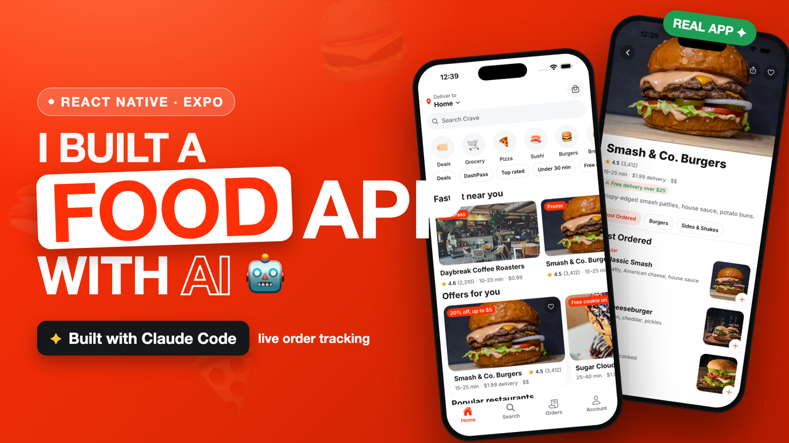
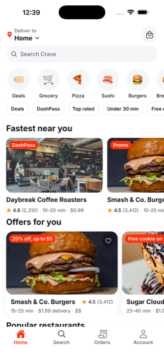
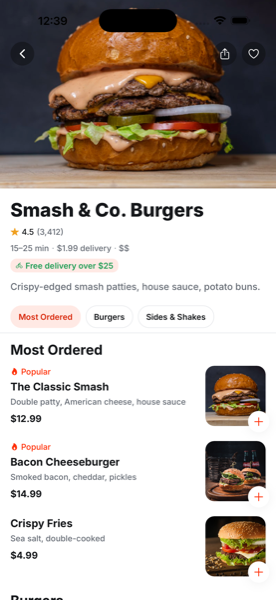
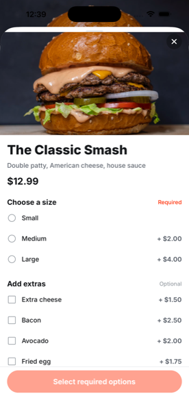

<div align="center">

# 🍔 Crave

### A polished, DoorDash‑inspired food‑delivery app — built with Expo + React Native, running entirely on a mock / on‑device backend.



[](https://expo.dev)
[](https://reactnative.dev)
[](https://www.typescriptlang.org)
[](https://docs.expo.dev/router/introduction/)
[](./LICENSE)

</div>

---

## ✨ Overview

**Crave** is a production‑quality food‑delivery mobile app: a location‑aware home feed, cuisine browsing, restaurant & menu detail, cart & mock checkout, **live‑style order tracking**, and order history — all powered by a **swappable local mock API** and on‑device persistence.

There are **no servers and no API keys**. Every screen renders from seeded data through a typed fake API layer (`src/services/api`) that simulates network latency, so the whole UI/UX is buildable and demoable instantly. When you outgrow mock/local, you replace **one module** with a real backend (Supabase / Firebase / REST) — without touching any screen.

> 🤖 This app was built end‑to‑end with **Claude Code**, driven by a set of phase‑scoped skills in [`.claude/skills/`](./.claude/skills).

---

## 🌐 Connect with Me

<div align="center">

If you find this project helpful, consider following along and supporting the work 💛

[](https://www.youtube.com/@reactjsBD)
[](https://github.com/noorjsdivs)
[](https://medium.com/@reactjsbd)
[](https://www.linkedin.com/in/noor-mohammad-ab2245193/)
[](https://www.instagram.com/simplenoor143/)
[](https://www.facebook.com/Noorlalu143/)
[](https://buymeacoffee.com/reactbd/extras/)

</div>

---

## 📸 Screenshots

<div align="center">

|                         Home feed                         |                   Restaurant detail                    |                Item customization                |
| :-------------------------------------------------------: | :----------------------------------------------------: | :----------------------------------------------: |
|           |  |  |
| Location header, categories, filter chips & feed sections |   Collapsing hero, sticky category strip, full menu    | Options with live price, quantity & add‑to‑cart  |

</div>

---

## 🚀 Features

- 🏠 **Home discovery** — location header, search, round category row, multi‑select filter chips, and feed carousels ("Fastest near you", "Offers for you", "Popular"), with pull‑to‑refresh and skeleton loaders.
- 🔎 **Search** — 250ms‑debounced queries, recent searches, suggested cuisines, and a filter sheet (sort / price / cuisine).
- 🍽️ **Restaurant detail** — parallax collapsing hero, a sticky category strip that scroll‑syncs to menu sections, and rich menu rows.
- 🧩 **Item customization** — radio/checkbox option groups with live price deltas, required‑option gating, quantity, and a **fly‑to‑cart** animation.
- 🛒 **Cart & checkout** — grouped lines, swipe‑to‑delete, promo codes (`CRAVE10`), full price breakdown, mock address/time/payment/tip — all in integer minor units.
- 🛵 **Live order tracking** — a map placeholder with a moving courier, a status timeline that advances on a timer (Confirmed → Delivered), courier card, and a delivered‑state rating prompt.
- 📋 **Orders & reorder** — active vs. past orders with live status, plus one‑tap reorder.
- 👤 **Account** — saved addresses, mock payment methods, appearance (system/light/dark), notification toggles, and favorites.
- 🔐 **Mock auth** — sign in with any email/phone, or continue as guest; checkout & orders are gated behind a session.
- 🎨 **Design system first** — every color, spacing, radius, font, and shadow comes from theme tokens. Light + dark. **Zero hardcoded design values.**
- ♿ **Accessible** — roles + labels on every control, 44×44 hit targets, AA contrast, and `reduce‑motion` honored throughout.
- 💾 **Persistent & offline** — cart, session, orders, and favorites survive a force‑quit; blurhash placeholders mean it works even with no network.

---

## 🛠️ Tech Stack

| Area       | Choice                                                                                           |
| ---------- | ------------------------------------------------------------------------------------------------ |
| Framework  | **Expo SDK 56** · React Native 0.85 · React 19 (New Architecture)                                |
| Language   | **TypeScript** (strict)                                                                          |
| Navigation | **Expo Router** (file‑based, typed routes)                                                       |
| Animation  | **Reanimated 4** + `react-native-worklets`                                                       |
| State      | **Zustand** (+ persist) for cart / session / favorites                                           |
| Storage    | **AsyncStorage**                                                                                 |
| Validation | **Zod**                                                                                          |
| UI / media | `expo-image` (blurhash), `@gorhom/bottom-sheet`, `react-native-svg`, `@expo/vector-icons`, Inter |
| Backend    | **Mock / local only** — a typed fake API with simulated latency (the single swap point)          |

---

## 🧑‍💻 Getting Started

```bash
# 1. install dependencies
npm install

# 2. start the dev server
npx expo start
```

Then:

- Press **`i`** to open the **iOS Simulator**, or **`a`** for an **Android emulator** (make sure one is running first).
- Or scan the QR code with **Expo Go** on a physical device.

Everything runs on seeded data — there's nothing to configure.

### Useful scripts

```bash
npx tsc --noEmit     # type‑check (strict)
npx expo lint        # lint
npx expo-doctor      # verify the project setup
```

---

## 📂 Project Structure

```
app/                      # Expo Router routes (file-based)
  _layout.tsx             # providers, fonts, splash hold, storage restore
  (auth)/                 # welcome (onboarding) + mock sign-in
  (tabs)/                 # Home · Search · Orders · Account
  restaurant/[id].tsx     # store detail (collapsing hero + menu)
  item/[id].tsx           # item customization (modal)
  cart.tsx · checkout.tsx · order/[id].tsx
src/
  theme/                  # tokens + ThemeProvider (light + dark)
  components/             # in-house component library
  services/
    api/                  # typed MOCK api (the swap point) + order clock
    storage/              # AsyncStorage helpers
  store/                  # Zustand stores (cart, session, favorites)
  mocks/                  # seed data: restaurants, menus, categories
  lib/                    # money, pricing, cart, validators
  types/                  # shared TS types
_props/                   # original planning docs / design spec
.claude/skills/           # the phase-scoped skills used to build this app
```

---

## 🔄 Swapping in a Real Backend

Because every screen reads data through hooks that call `src/services/api`, going live means re‑implementing **that one module** against a real client — no screen changes required. Similarly, `src/components/MapView` is a placeholder behind the same prop shape a real `expo-maps` / `react-native-maps` view would use, and mock auth can be replaced with real auth in `src/store/session.ts`.

---

## 📝 License

[MIT](./LICENSE) — design language is _inspired by_ DoorDash; all copy, branding, colors, and assets here are original. Food photography via [Unsplash](https://unsplash.com/license).

<div align="center">

Built with ❤️ and [Claude Code](https://claude.com/claude-code).

</div>
